# Web-Frameworks-Projects
WF- Projects

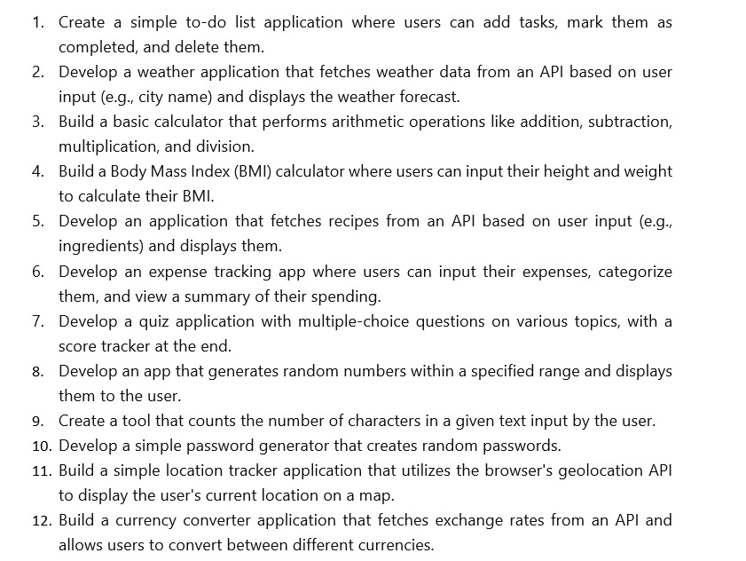

**Warning**

Never use the API that is mentioned in this repo 

**Weather Application **
For API 

Use this Website 

(Open Weather)[https://openweathermap.org/]

**OUTPUT** 
<b> 1.Weather </b>
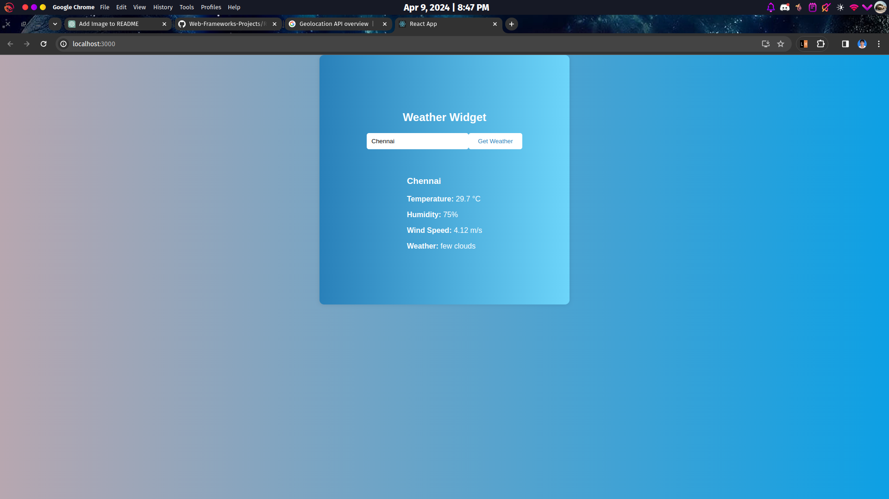

<b> 2.To-do-List</b>
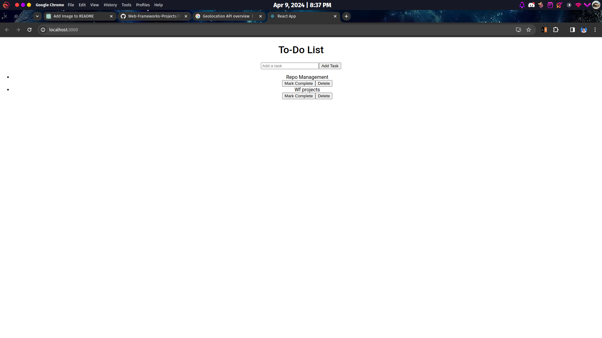

<b> 3. BMI-Calculator </b>

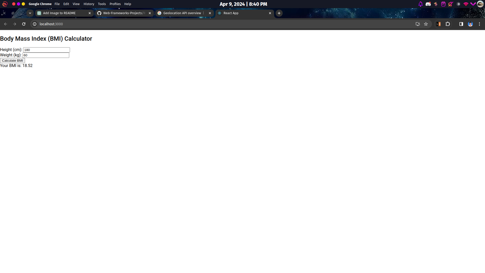

<b> 4. calculator </b>
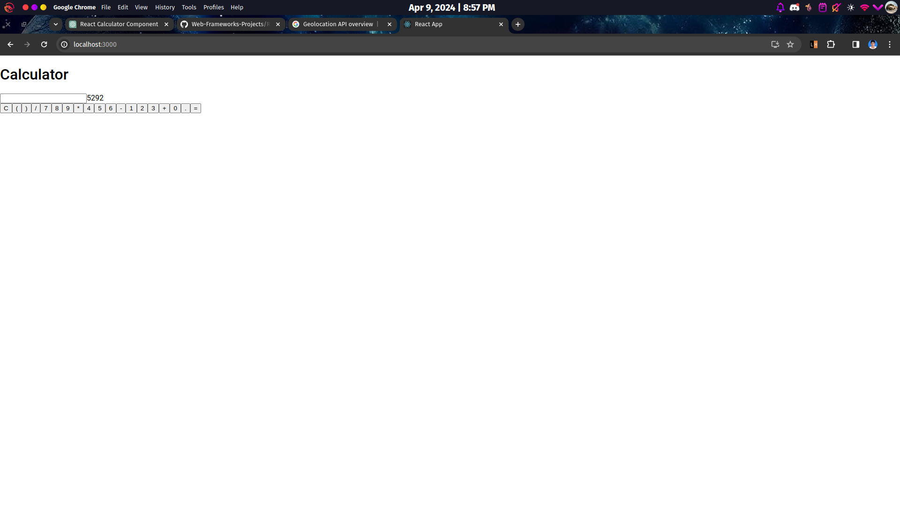

<b> 5. charater-count </b>
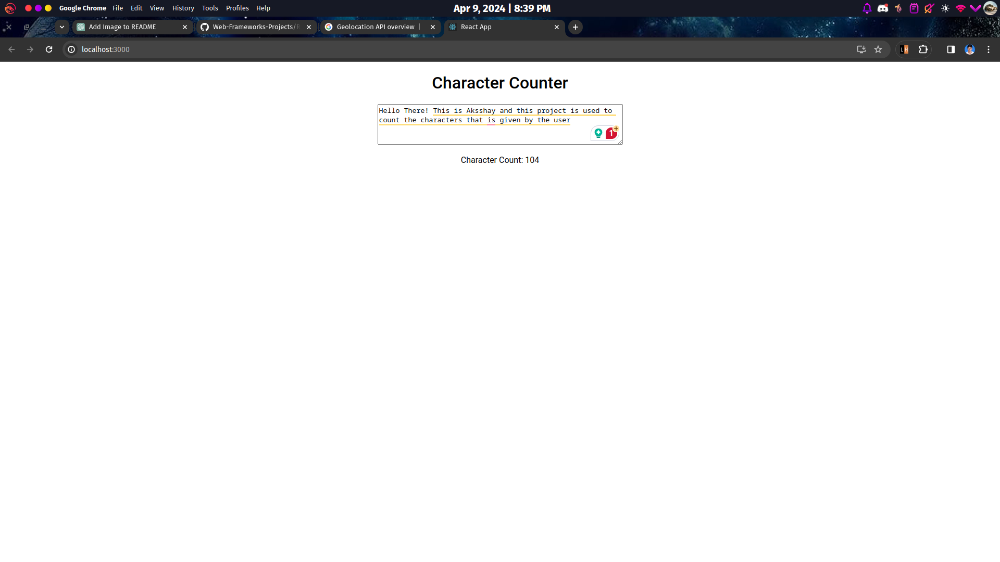

<b> 6. currency-converter </b>
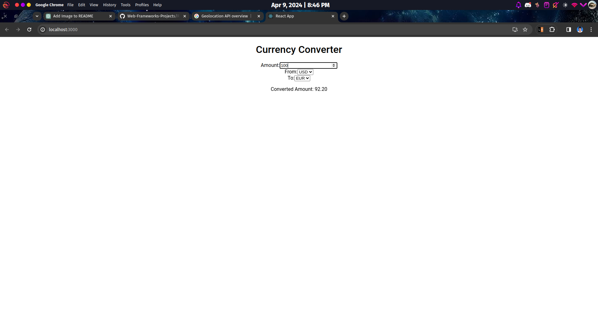

<b> 7. expense-tracker </b>
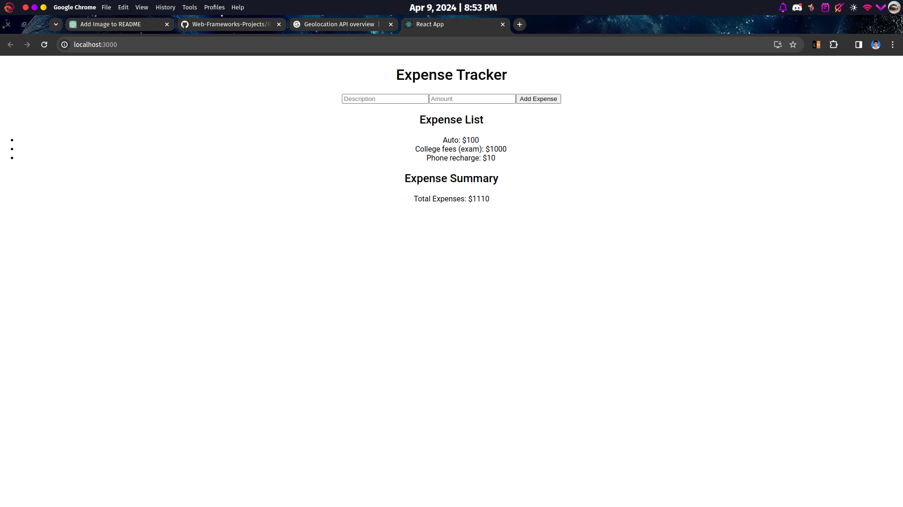

<b> 8. pass-gene  </b>
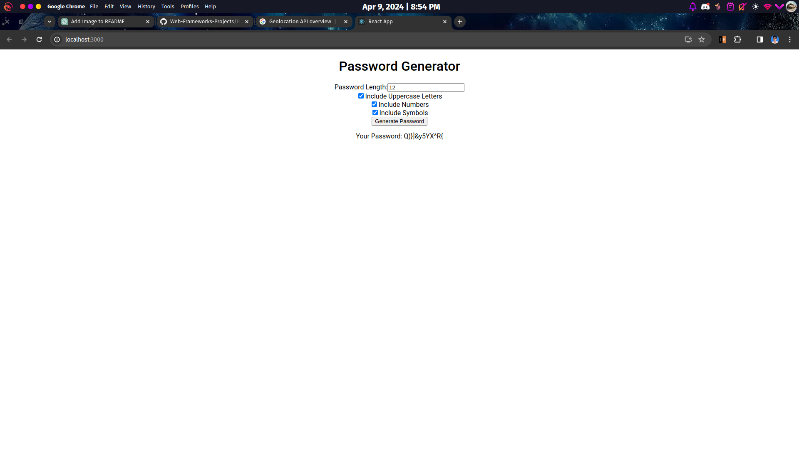

<b> 9. quiz-application  </b>
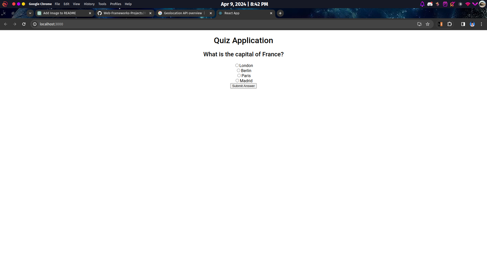

<b> 10. random-number  </b>
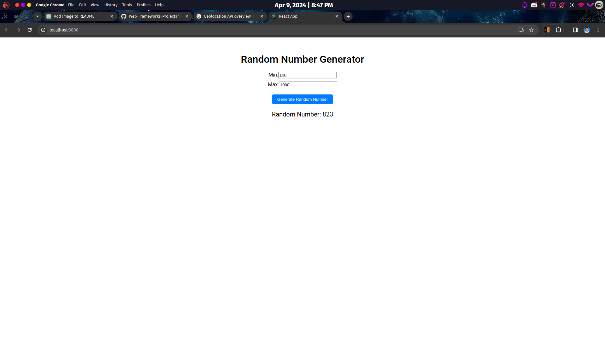

<b> 11. recipe-search1  </b>
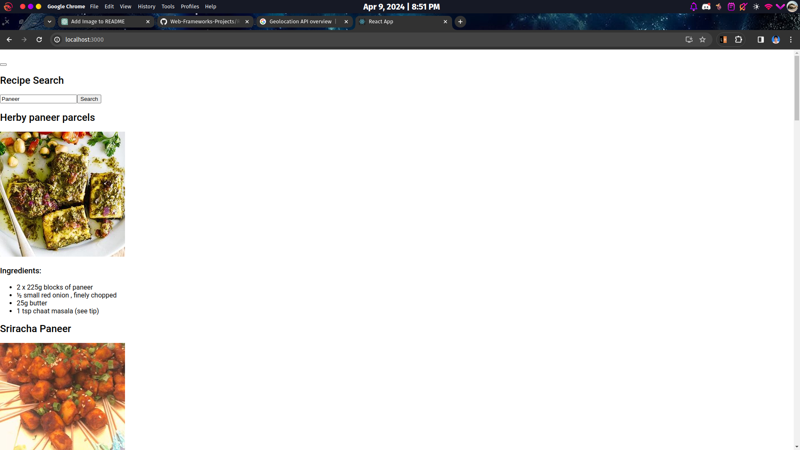

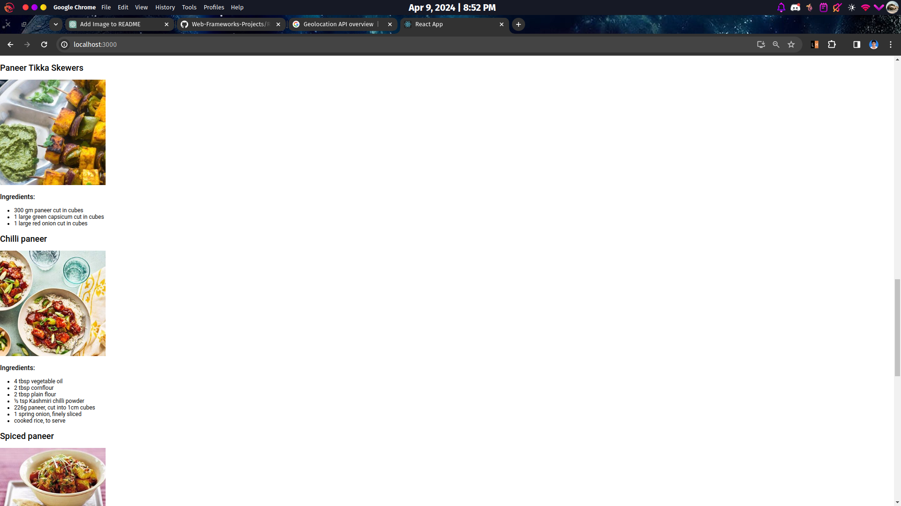
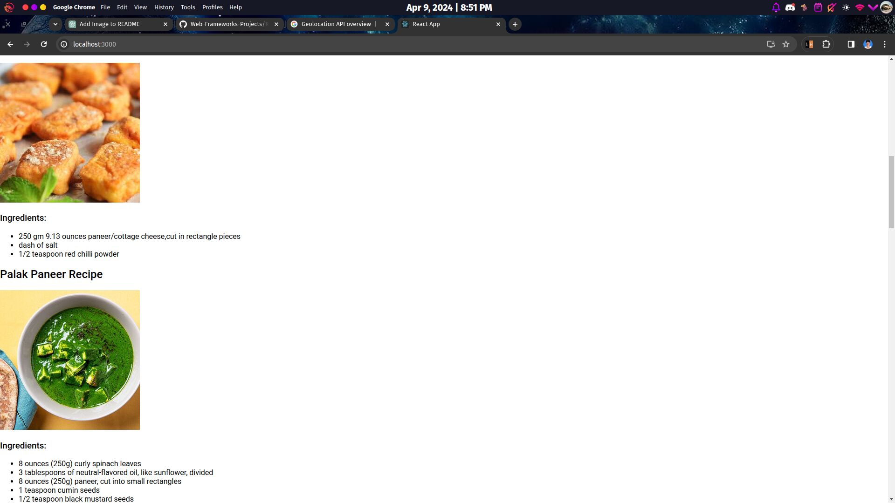

